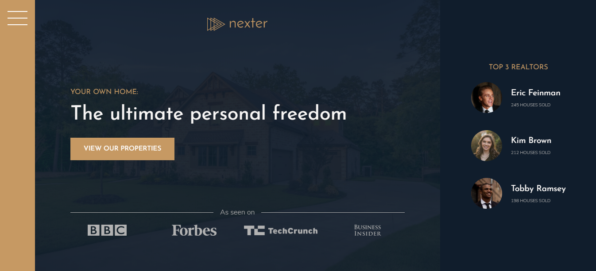

# Nexter Project

> A real estate luxury agency landing page. The website is built with HTML5 / CSS3 / SASS / BEM Architecture.



 &nbsp; &nbsp; &nbsp; 

## Table of contents

- [Nexter Project](#nexter-project)
  - [Table of contents](#table-of-contents)
  - [General info](#general-info)
  - [Technologies](#technologies)
  - [Installation and Usage](#installation-and-usage)
    - [Dev Mode](#dev-mode)
    - [Prod Mode](#prod-mode)
    - [Live Demo](#live-demo)
  - [To-do list](#to-do-list)
  - [Status](#status)
  - [Contact](#contact)

## General info

Nexter is a fully responsive website.
The main purpose for this project is to put into context new learned skills about how Css Grid  works.

## Technologies

- HTML5
- CSS3 / SCSS

## Installation and Usage

Prerequisites: [Node.js](https://nodejs.org/download/release/v13.14.0/) (13.14.0). As of latest version 14.3.0 some dependencies break at install.

To run this project:

- Clone this repo to your local machine using

```shell
$ git clone https://github.com/francislagares/nexter-project
```

- Switch into directory

```shell
$ cd nexter-project
```

- Install dependencies

```shell
$ yarn install
```

### Dev Mode

- Run server

```shell
$ yarn start
```

- Browser will open automatically at http://localhost:3000

### Prod Mode

- Make a build

```shell
$ yarn build
```

- Run Express Server

```shell
$ yarn serve
```

- Open http://localhost:3000 in your browser.

### Live Demo

You can see the application running
[here.](https://francislagares.github.io/nexter-project/)

## To-do list

This project is not complete though as the main focus was to implement and understand the techniques described and there are some more features that could be implemented, like following:

- Implement menu & website navigation.
- Create a lightbox.
- Make individual sections for homes.
- Optimize images for small devices.

## Status

Currently: _in progress_...

## Contact

Created by [@francislagares](https://www.linkedin.com/in/francislagares/) - feel free to contact me!
